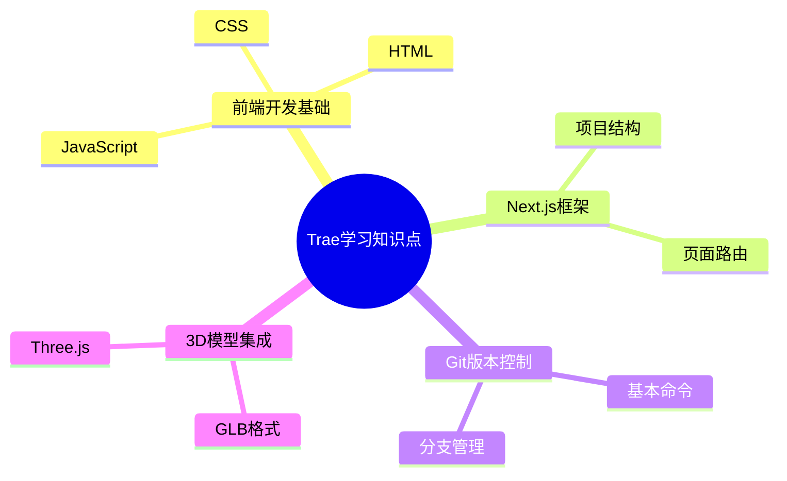

# Trae学习知识点总结

## 1. 前端开发基础
- HTML
  - 基础标签
  - 表单元素
- CSS
  - 选择器
  - 盒模型
  - Flex布局
- JavaScript
  - 基础语法
  - DOM操作
  - 异步编程

## 2. Next.js框架
- 项目结构
- 页面路由
- 数据获取
- 部署流程

## 3. Git版本控制
- 基本命令
- 分支管理
- 协作流程

## 4. 3D模型集成
- GLB格式
- Three.js基础
- 模型展示

## 5. 知识点关联

1. **前端基础与Next.js**
   - HTML/CSS构成页面基础结构
   - JavaScript实现交互逻辑
   - Next.js基于React扩展了服务端渲染能力

2. **Git与项目开发**
   - 版本控制贯穿整个开发周期
   - 分支管理支持多人协作开发
   - 部署流程依赖Git版本管理

3. **3D模型集成**
   - 依赖JavaScript(Three.js)实现
   - 可与Next.js项目无缝集成
   - GLB格式优化模型加载性能

4. **技术栈协同**
   - 前端基础 → Next.js开发 → Git管理 → 3D增强
   - 形成完整的前端开发生态链

## 6. 智能体整合
1. **前端基础与智能体**
   - HTML/CSS构建智能体交互界面
   - JavaScript实现智能体核心逻辑
   - 异步编程处理智能体API调用

2. **Next.js与智能体**
   - 服务端渲染优化智能体首屏性能
   - API路由封装智能体服务接口
   - 数据获取处理智能体响应

3. **Git与智能体开发**
   - 版本控制管理智能体迭代
   - 分支策略支持多智能体并行开发
   - 协作流程规范团队开发

4. **3D模型与智能体**
   - Three.js实现智能体3D可视化
   - GLB格式优化智能体模型加载
   - 交互式3D增强用户体验

5. **技术栈协同**
   - 前端基础 → Next.js框架 → Git管理 → 3D增强 → 智能体整合
   - 形成智能体应用完整技术链